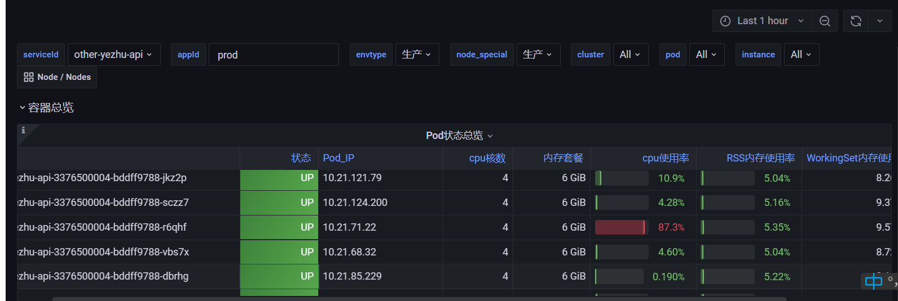

:page-layout: post
:page-title: php7.2.11在低内存节点性能低的问题分析
:page-categories: blog
include::../attributes.adoc[]

== 问题描述

在集群中部署了一组php的服务，使用php7.2.11版本。然后在运行中出现了很诡异的现象。cpu在不同的pod中的占用率，很不均衡，如图。

这导致业务方接口出现大量http code 499问题。经过一番排查，我们确定，流量无论从7层网关日志看，还是从节点accesslog日志看，都是均衡的。这就更加奇怪了。因此怀疑是宿主机节点的差异导致的。宿主机节点cpu占用在20-30%，但是内存占用较高。因此初步怀疑是内存占用高的情况才出现。但是即使同样是80%内存占用的节点，也并不都有这样的问题。因此排查方向非常不明朗。

国庆节前，事情出现了转机，有业务方的服务，在某个节点上能稳定复现这样的情况，因此我决定，在国庆节期间，重点攻克这个问题(请原谅我这么卷，因为平时这个问题真的不容易稳定复现，节点上服务多，影响多，机不可失)。

尝试了一些性能分析工具，最后通过strace工具，让真正的问题浮出水面。strace -T -tt -e trace=all -p27639 -o output.txt,截取报文如下：

[source,text]
====
10:53:01.519610 madvise(0x7f4349000000, 134221824, MADV_HUGEPAGE) = 0 <0.000008>
10:53:28.714302 munmap(0x7f436a800000, 67112960) = 0 <0.003810>
====

可以看到madvise命令占用了大量的时间，通过google，发现了一个link:https://bugs.php.net/bug.php?id=77622[php的bug报告]。

报告中指出MADV_HUGEPAGE在低内存时对性能有很大的影响，并在后续的版本中默认禁用。通过查看commit记录，最早于7.2.16版本默认禁用，因此，升级php解决可解决此问题。

在排查此问题的过程中，还发现了其他诡异的问题：

. wrk压测忽然停止，但命令没有任何报错，只是hang住
. ab压测，长连接为何不生效
. 压测时为何总有一个节点cpu占用到100%，其他节点占用却在50-70%

这些问题的原因是什么，请参见link:strange-stress[压测下的诡异现象]

排查过程其实很曲折，总耗时2天...
