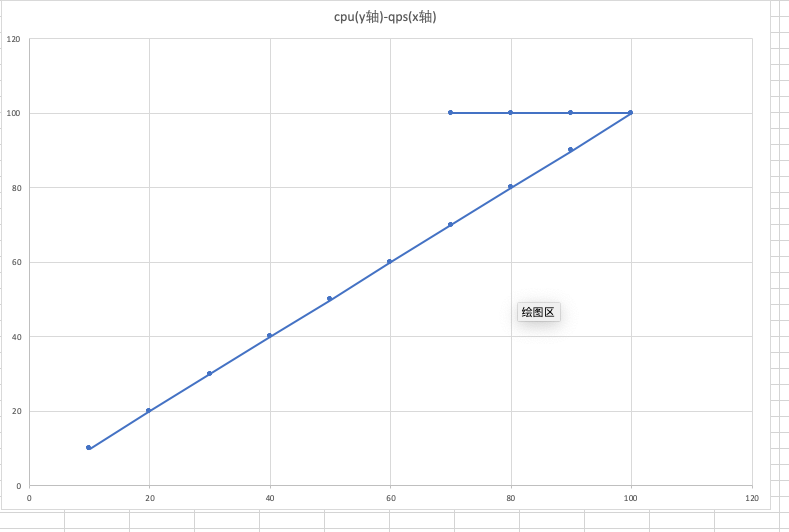

:page-layout: post
:page-title: 压测下的诡异现象
:page-categories: blog
include::../attributes.adoc[]

== 前言

在link:php-low-memory[php7.2.11在低内存节点性能低的问题分析]一文中，末尾提到，排查问题的过程中，还遇到了一系列诡异的现象，这里记录一些，并简要解释一下各种诡异现象的形成原因。

. wrk压测忽然停止，但命令没有任何报错，只是hang住
+
最开始选择使用wrk进行压测，但是发现如果连接数很高的话，经常会出现命令假死。现象是，使用ps -ef，发现wrk进程还在，但是已经不产生任何流量了。经过一番排查，发现原来是wrk在端口不够用的情况下，会无法继续工作，使用netstat -anlp命令，可以看到大量的TIME_WAIT连接。最大连接数和net.ipv4.ip_local_port_range有关。可以调整服务端支持长连接，再进行压测。避免过多的短连接造成此问题。

. 在我不清楚上述问题的根因下，我打算换到ab做压测，并且调整服务端支持长连接。可是竟然仍然发现大量短连接，后来排查发现，原来ab不支持http1.1，在http1.0下，ab通过传Keep-alive头支持长连接，可以恰好使用的tengine在http1.0下，即使传Keep-alive头也不支持长连接，这应该算是tengine的bug，没有遵守http协议。

. 由于没有压测经验，一开始压测参数过高，发现一组pod中，总有一个cpu会占用100%，但奇怪的是，其他cpu却占用在50-70%。如果销毁掉那个有问题的pod，马上又会有另一个pod cpu占用100%，就像是在选举一样。如果这时，单独给某一个cpu非100%的pod施加一些流量压力，会发现这个pod占用到100%了，而原来的那个100%cpu的pod，cpu占用率就降低了。这非常奇怪。后来经排查发现，原来这是由于压力过大造成的诡异现象，由于使用k8s service转发流量，轮询的方式则会导致短板效应非常明显。当压力逐步增大，直到过载时，单个pod的负载从峰值变低，由于轮询的方式，其实所有的pod都会变低，但是负载最先变低的那个pod，由于流量一直压过来，则cpu一直满载，其他pod则由于这种那个pod的短板效应，有了喘息机会，因此cpu占用率得以下降。

这里我用一个简单的图表来说明情况，假设cpu利用率和qps的关系如下图：

在压力过载的情况下，cpu会维持到100%，但是qps会降低，因此，qps相同的情况下，cpu占用却可能对应两个值。那么某个pod的cpu到底应该取哪个值呢？结合负载均衡的轮询方式，希望你能想明白上述诡异现象的原因。我想这真的很难表达出来，只可意会。
